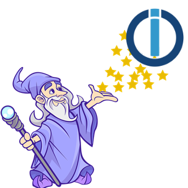

# ioBroker.futterautomat

**Tests:** 

## futterautomat adapter for ioBroker

Steuerung für (umgebaute) Futterautomaten: Der Adapter schaltet bis zu **5 frei wählbare
Schalter** (vorhandene ioBroker-Objekte) zeitgesteuert für eine einstellbare Dauer ein und
wieder aus. Optional werden Luft- und Wassertemperatur berücksichtigt, und über die
Geokoordinaten wird der Sonnenstand berechnet, damit nachts nicht gefüttert wird.

### Funktionen

* Bis zu 5 Schalter, jeweils mit frei wählbarem Namen (= eigener Konfigurations-Tab).
* Zwei Fütterungsmodi je Schalter:
  * **Feste Zeiten** (z. B. 08:00 und 18:00).
  * **Intervall innerhalb eines Zeitraums** (z. B. alle 60 Min zwischen 08:00 und 18:00).
* Einstellbare **Fütterungsdauer in Sekunden** je Schalter.
* **Temperatursperren**: Fütterung unter- bzw. oberhalb frei wählbarer Wasser- und/oder
  Lufttemperaturen blockieren.
* **Nachtsperre** über Sonnenauf-/-untergang mit konfigurierbarem Offset (morgens/abends).
* **Manueller Auslöser** (`feedNow`) je Schalter, optional unter Umgehung aller Sperren.

### Konfiguration

**Tab „Grundeinstellungen"**
* **Standort (verpflichtend)**: Systemeinstellungen übernehmen *oder* spezifisch festlegen –
  per Adresssuche und Markierung auf einer OpenStreetMap-Karte (kein API-Key nötig).
* **Sonnenfenster**: Offsets in Minuten nach Sonnenaufgang / vor Sonnenuntergang.
* **Temperaturquellen**: Luft- und Wassertemperatur aktivieren und das jeweilige Objekt wählen.
* **Schalter**: Schalter hinzufügen (max. 5), Namen vergeben, Objekt auswählen, aktivieren.

**Tab je Schalter** (erscheint dynamisch, beschriftet mit dem Schalternamen)
* Modus (feste Zeiten / Intervall), Zeiten bzw. Zeitfenster + Intervall, Fütterungsdauer,
  Temperatursperren, Nacht-/Manuell-Optionen.

### Datenpunkte

Global:
* `info.connection` – Adapter läuft / Konfiguration gültig
* `airTemperature`, `waterTemperature` – aktuell erfasste Temperaturen
* `sunrise`, `sunset` – berechnete Zeiten

Pro Schalter unter `switches.<id>.`:
* `feedingActive` – Fütterung läuft gerade
* `lastFeeding`, `nextFeeding` – letzte / nächste Fütterung
* `blocked`, `blockReason` – aktuell blockiert + Grund
* `feedNow` – manueller Auslöser (beschreibbar)

> Hinweis: Adresssuche/Geocoding (Nominatim) und die Kartenkacheln benötigen einen
> Internetzugang. Das Geocoding läuft im Adapter-Backend; die Instanz muss dafür laufen.

## Changelog
<!--
	Placeholder for the next version (at the beginning of the line):
	### **WORK IN PROGRESS**
-->

### **WORK IN PROGRESS**
* (ssbingo) initial release

## License
MIT License

Copyright (c) 2026 ssbingo <s.sternitzke@online.de>

Permission is hereby granted, free of charge, to any person obtaining a copy
of this software and associated documentation files (the "Software"), to deal
in the Software without restriction, including without limitation the rights
to use, copy, modify, merge, publish, distribute, sublicense, and/or sell
copies of the Software, and to permit persons to whom the Software is
furnished to do so, subject to the following conditions:

The above copyright notice and this permission notice shall be included in all
copies or substantial portions of the Software.

THE SOFTWARE IS PROVIDED "AS IS", WITHOUT WARRANTY OF ANY KIND, EXPRESS OR
IMPLIED, INCLUDING BUT NOT LIMITED TO THE WARRANTIES OF MERCHANTABILITY,
FITNESS FOR A PARTICULAR PURPOSE AND NONINFRINGEMENT. IN NO EVENT SHALL THE
AUTHORS OR COPYRIGHT HOLDERS BE LIABLE FOR ANY CLAIM, DAMAGES OR OTHER
LIABILITY, WHETHER IN AN ACTION OF CONTRACT, TORT OR OTHERWISE, ARISING FROM,
OUT OF OR IN CONNECTION WITH THE SOFTWARE OR THE USE OR OTHER DEALINGS IN THE
SOFTWARE.
