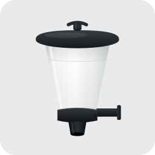

# ioBroker.automatic-feeder

  

## Adaptador automatic-feeder para ioBroker

Este adaptador transforma qualquer interruptor já existente no ioBroker (uma
tomada, um relé, uma saída GPIO …) num **alimentador automático controlado por tempo**. Ele
liga a saída nos horários que você definir, por um número determinado de segundos,
podendo levar em conta a temperatura e a alternância dia/noite, para que nunca se alimente
na hora errada.

Este documento é um guia completo. Se você nunca usou o adaptador,
leia-o de cima para baixo – o **Início rápido** o leva à primeira
alimentação em poucos minutos, e o restante explica cada configuração em detalhe.

---

## Índice

1. [O que o adaptador faz](#1-o-que-o-adaptador-faz)
2. [Pré-requisitos](#2-pré-requisitos)
3. [Instalação](#3-instalação)
4. [Início rápido](#4-início-rápido--a-primeira-alimentação)
5. [A página de configurações em detalhe](#5-a-página-de-configurações-em-detalhe)
6. [Objetos / Pontos de dados](#6-objetos--pontos-de-dados)
7. [Exemplos / Receitas](#7-exemplos--receitas)
8. [Notificações do Telegram](#8-notificações-do-telegram)
9. [Solução de problemas & FAQ](#9-solução-de-problemas--faq)
10. [Logging & Diagnóstico](#10-logging--diagnóstico)
11. [Alimentação dinâmica — contexto e fontes](#11-alimentação-dinâmica--contexto-e-fontes)
---

## 1. O que o adaptador faz

Uma „alimentação" é, no fundo, bem simples: **saída LIGA → aguardar um número ajustável de
segundos → DESLIGA novamente**. Num alimentador automático adaptado, o motor funciona durante esse
tempo e libera ração.

O adaptador gerencia **até 5 interruptores**, cada um totalmente independente e com sua própria
aba de configuração, nomeada conforme o interruptor. Para cada interruptor você define:

* **quando** alimentar – seja em **horários fixos** (p. ex. 08:00 e 18:00) ou em
  **intervalo** dentro de uma janela de tempo (p. ex. a cada 60 minutos entre 08:00 e 18:00);
* **por quanto tempo** a saída permanece ligada (duração da alimentação em segundos);
* **se há bloqueio** quando a temperatura da água ou do ar estiver muito baixa/alta;
* **se restringir** a alimentação à janela astronómica do dia (nascer/pôr do sol com offsets
  por interruptor, a partir de uma localização de sistema, partilhada ou por interruptor);
* **se o processo de comutação é monitorado** (verificação de que realmente houve liga e
  desliga) e, opcionalmente, é enviada uma mensagem do **Telegram** com o resultado;
* **se reduzir ou pausar** a alimentação durante uma temporada de **inverno** recorrente –
  opcionalmente com lembretes do Telegram antes de começar e de terminar;
* **se adaptar** o intervalo e a porção automaticamente à temperatura da água/do ar
  (**alimentação dinâmica**, modelo Q10);
* **se bloquear** a alimentação quando o **oxigénio** dissolvido (O₂) estiver muito baixo;
* **até 3 pausas de alimentação** pontuais (períodos absolutos de data/hora, p. ex. uma
  quarentena após um repovoamento) com uma mensagem do **Telegram** no início e no fim de cada uma;
* um **interruptor principal de pausa** (*Suspender alimentação agora*) que suspende
  instantaneamente **toda** a alimentação de um interruptor até você desligá-lo novamente, com uma
  mensagem do **Telegram** a cada alternância.

Você pode acionar uma alimentação **manualmente** a qualquer momento – diretamente na página de
configurações (botão com duração livremente selecionável) ou através de um ponto de dados (p. ex. um
botão numa visualização VIS).

> Importante: O adaptador não cria o interruptor por conta própria. Ele **controla um objeto já
> existente** no seu ioBroker. Esse objeto você seleciona na configuração.

---

## 2. Pré-requisitos

| Você precisa de | Detalhes |
|-------------|---------|
| **ioBroker** com **admin** atual (≥ 7) | A página de configuração é implementada com React. |
| **Um objeto de interruptor** | Um ponto de dados gravável do ioBroker que liga/desliga o alimentador automático – p. ex. uma tomada (`shelly.0.…`, `sonoff.0.…`, `zigbee.0.…`), um relé ou uma variável de script. |
| *(opcional)* **Coordenadas geográficas** | Usadas para calcular o nascer/pôr do sol da **janela astronómica** por interruptor. Só são necessárias se um interruptor usar essa janela; obtidas das configurações de sistema do ioBroker, de uma posição partilhada, ou configuradas por interruptor. |
| *(opcional)* Objetos de temperatura | Pontos de dados existentes com temperatura do ar e/ou da água, para o bloqueio por temperatura ou a alimentação dinâmica. Atribuídos **por interruptor** na aba do interruptor. |
| *(opcional)* Objetos de **oxigénio (O₂)** | Pontos de dados existentes com o oxigénio dissolvido, para bloquear a alimentação quando ele cair demais. Atribuídos **por interruptor**. |
| *(opcional)* Uma instância do **Telegram** | O adaptador oficial `telegram`, configurado e iniciado, caso você queira notificações push. |
| Acesso à internet no host do ioBroker | Apenas para a busca de endereço/mapa na configuração. A operação normal funciona offline. |

---

## 3. Instalação

1. No **admin** do ioBroker, abrir a aba **Adaptadores** (Adapter).
2. Localizar **automatic-feeder** na lista de adaptadores e clicar em **Instalar**.
3. Criar uma **instância** do adaptador.
4. Abrir as configurações da instância (ícone de engrenagem) – deve aparecer a página de
   configuração com a aba **Configurações básicas** (Grundeinstellungen). Se ela ficar vazia, ver [Solução de problemas](#9-solução-de-problemas--faq).

---

## 4. Início rápido – a primeira alimentação

Objetivo: Um interruptor deve – imediatamente, para teste – alimentar por 5 segundos.

1. **Abrir as configurações** da instância automatic-feeder.
2. Na aba **Configurações básicas** (Grundeinstellungen):
   * Em **Localização**, deixar *Usar configurações de sistema para todos os interruptores*
     selecionado (só relevante se você ativar mais tarde a janela astronómica). Você também pode
     escolher uma localização partilhada ou configurá-la por interruptor.
   * Rolar para baixo até **Interruptores** e clicar em **Adicionar interruptor**.
   * Atribuir um **Nome** (p. ex. `Koi-Teich`). Esse nome se torna o título de uma aba própria.
   * Ao lado de **Objeto de interruptor**, clicar no ícone de lista e escolher o ponto de dados que aciona
     o seu alimentador (p. ex. a sua tomada). O interruptor deve estar **ativo** (caixa marcada à esquerda).
3. **Salvar** (disquete/visto na parte inferior). Aparece uma nova aba com o nome do seu interruptor.
4. Abrir essa **aba do interruptor**. Bem no topo, em **Alimentação manual**, ajustar uma duração
   (p. ex. `5` segundos) e clicar em **Alimentar agora**. A saída deve ligar por 5 segundos e
   depois desligar novamente.
5. Na mesma aba, configurar o cronograma real em **Plano de alimentação** (p. ex. horários fixos
   08:00 e 18:00) e definir a **Duração da alimentação** em **Processo de alimentação**, depois
   **Salvar**.

Pronto – a partir de agora o adaptador alimenta automaticamente. Todo o resto explica as opções em detalhe.

---

## 5. A página de configurações em detalhe

A configuração tem uma aba **Configurações básicas** (Grundeinstellungen), bem como **uma aba por interruptor** (é
criada automaticamente assim que um interruptor recebe um nome). Caso uma página não role, ampliar a
janela ou usar a barra de rolagem à direita – todas as seções são acessíveis.

### 5.1 Aba „Configurações básicas" (Grundeinstellungen)

#### Localização (para a janela astronómica)

A localização é usada para calcular o nascer/pôr do sol da **janela astronómica de alimentação**
que pode ser ativada por interruptor (ver *Restrições* na aba do interruptor). Só é necessária se
pelo menos um interruptor usar essa janela. Três possibilidades:

* **Usar configurações de sistema para todos os interruptores** – usa latitude/longitude da
  configuração de sistema do ioBroker (recomendado, se já estiverem definidas lá). Os valores
  atuais são exibidos.
* **Uma localização partilhada para todos os interruptores** – define uma única posição que todos
  os interruptores usam:
  * Inserir um **endereço** e pressionar **Buscar**. O adaptador o resolve (via
    OpenStreetMap / Nominatim) e define um marcador.
  * Ou **clicar no mapa** / **arrastar o marcador** para escolher o local exato.
  * Latitude/longitude também podem ser inseridas diretamente; o mapa acompanha.
* **Configurar a localização individualmente por interruptor** – cada interruptor define a sua
  própria localização na sua própria aba (útil quando as estações de alimentação, p. ex. lagos,
  estão em locais diferentes).

> A busca de endereço é executada no backend do adaptador, portanto a **instância precisa estar em
> execução**. Mapa e busca exigem acesso à internet.

Os **offsets do nascer/pôr do sol são configurados por interruptor** (em *Restrições*), e os
horários calculados são publicados por interruptor como `status.sunrise` / `status.sunset`,
recalculados automaticamente todas as noites.

#### Interruptores

A lista dos alimentadores automáticos (até 5). Por entrada:

* **Ativo** (caixa) – apenas interruptores ativos são planejados.
* **Nome** – texto livre; torna-se o título da aba do interruptor e o nome do canal na árvore de objetos.
* **Objeto de interruptor** – o ponto de dados existente do ioBroker que é controlado. Selecionar
  através do ícone de lista, limpar através da cruz.

Com **Adicionar interruptor** você cria mais um (máx. 5), com o ícone da lixeira você
remove um. Ao remover, também são excluídos os pontos de dados dele.

### 5.2 Abas dos interruptores

Cada interruptor configurado recebe uma aba própria com seu nome. Ela contém as seguintes
seções.

#### Alimentação manual

* **Duração da alimentação manual (segundos)** – a duração usada pelo botão.
* **Alimentar agora** – aciona imediatamente uma alimentação com essa duração. Prático para testes ou
  para uma porção extra. (Se os bloqueios são ignorados depende de *O acionador manual ignora
  todos os bloqueios* em *Restrições*.)
* Para o botão, a instância precisa estar em execução e a configuração precisa estar **salva**.

#### Plano de alimentação

Escolher **um** modo:

* **Horários fixos** – uma lista de horários (`HH:mm`). Adicionar quantos quiser; o
  alimentador funciona diariamente em cada um deles. Exemplo: `08:00` e `18:00`.
* **Intervalo dentro de um período** – alimentar repetidamente dentro de uma janela:
  * **Início do período** / **Fim do período** – p. ex. 08:00 até 18:00.
  * **Intervalo (minutos)** – p. ex. 60 → alimenta diariamente às 08:00, 09:00, … até o fim da janela.

Se a **janela astronómica** estiver ativada (ver *Restrições*), o início/fim fixos do período são
substituídos pela janela do nascer/pôr do sol e ficam ocultos; o intervalo então corre entre o
nascer e o pôr do sol. O próximo horário planejado consta a qualquer momento no ponto de dados
`status.nextFeeding`.

#### Processo de alimentação

* **Duração da alimentação (segundos)** – por quanto tempo a saída permanece LIGADA numa alimentação planejada.
* **Valor de ligado** / **Valor de desligado** – os valores que são gravados no objeto de interruptor.
  O padrão é `true` e `false`, o que combina com a maioria das tomadas/relés. Se o seu
  dispositivo espera números ou texto, inserir aqui p. ex. `1` / `0` ou `ON` / `OFF`.

#### Fontes de temperatura & oxigénio

Cada interruptor (estação de alimentação) tem os **seus próprios** sensores – lagos/tanques diferentes podem usar objetos diferentes:

* **Temperatura do ar** – marcar a caixa e selecionar o ponto de dados que contém a temperatura do ar desta estação.
* **Temperatura da água** – marcar a caixa e selecionar o ponto de dados que contém a temperatura da água desta estação.
  Este é o sensor principal da **zona de alimentação** (coloque-o onde os peixes realmente se alimentam, não na superfície).
* **Temperatura da água (profunda)** – *segundo sensor opcional* de água (p. ex. perto do fundo). Só é exibido depois de
  o sensor de água principal estar ativado. Com dois sensores você escolhe um **modo de combinação** para a alimentação dinâmica:
  *Zona de alimentação (só superficial)* [padrão], *Média de ambos*, *Camada mais fria* ou *Sazonal* (usa o sensor superficial
  enquanto ele estiver em ou acima de um limite, caso contrário o sensor profundo). O **bloqueio** por temperatura
  usa sempre a camada **mais fria** dos dois. Um segundo sensor só ajuda em **lagos profundos e não misturados**
  (uma bomba em funcionamento mistura a água e elimina qualquer estratificação) — veja *Alimentação dinâmica — contexto & fontes*.
* **Oxigénio (O₂)** – marcar a caixa e selecionar o ponto de dados que contém o oxigénio dissolvido.

Só fazem sentido pontos de dados numéricos. Os valores atuais são espelhados nos pontos de dados `status.airTemperature`, `status.waterTemperature`, `status.waterTemperatureDeep`, `status.oxygen` (e `status.waterStratification` = superficial − profunda) deste interruptor. Os limites são definidos abaixo (*Bloqueio por temperatura*), e as temperaturas também alimentam a *Alimentação dinâmica*.

#### Bloqueio por temperatura

É exibido apenas para as fontes de temperatura ativadas acima (*Fontes de temperatura & oxigénio*). Por interruptor:

* **Bloquear por temperatura da água** – *Bloquear se abaixo de* e/ou *Bloquear se acima de* (°C).
* **Bloquear por temperatura do ar** – o mesmo para o ar.

Se a temperatura atual estiver fora da faixa permitida, a alimentação é ignorada
e o motivo é gravado em `status.blockReason`. (Se um valor de temperatura for desconhecido, essa
fonte não bloqueia.)

#### Restrições

* **Restringir a alimentação à janela astronómica do dia (nascer/pôr do sol + offsets)** – quando
  ativo, a alimentação fica limitada à janela diurna calculada a partir da localização deste
  interruptor. Para *Intervalo* e *Alimentação dinâmica*, essa janela substitui o início/fim fixos
  do período; para *Horários fixos* atua como proteção dia/noite (os horários fora da janela são
  ignorados). Quando ativado você pode definir:
  * **Minutos após o nascer do sol** – começar tantos minutos *após* o nascer do sol (padrão 0).
  * **Minutos antes do pôr do sol** – parar tantos minutos *antes* do pôr do sol (padrão 0).
  * **Localização para este interruptor** – só é exibida quando a *Localização* geral está definida
    como *individual*: escolher *Usar configurações de sistema* ou *Definir localização específica*
    (busca de endereço + mapa) para este interruptor. Os horários calculados aparecem em
    `status.sunrise` / `status.sunset`.
* **O acionador manual ignora todos os bloqueios** – quando ativo, o botão e os
  pontos de dados `feedNow` / `feedFor` alimentam mesmo com bloqueio de temperatura/janela ativo.

#### Alimentação dinâmica

Opcional: adapta o **intervalo e a duração da alimentação à temperatura** com o modelo Q10 (o metabolismo praticamente duplica a cada +10 °C). Requer uma fonte de temperatura ativa; os horários fixos são então substituídos por um intervalo dentro da janela.

* **Ativar / fonte** – ative e escolha a temperatura da água ou do ar. Quando um segundo sensor de água (profundo) está configurado, a temperatura da água usada aqui é combinada das duas camadas conforme o modo de combinação escolhido (ver *Fontes de temperatura & oxigénio*).
* **Referência / Q10** – o intervalo e a duração base aplicam-se à temperatura de referência (p. ex. 20 °C); Q10 normalmente 2–2,5 (o metabolismo praticamente duplica a cada +10 °C — veja *Alimentação dinâmica — contexto & fontes*).
* **Intervalo / duração (base, mín, máx)** – limites para o intervalo calculado (minutos) e a duração (segundos). O **intervalo base e o intervalo máximo devem ser maiores que 0**, caso contrário nenhuma alimentação pode ser planejada.
* **Janela de média / histerese** – uma média móvel (p. ex. 24 h) suaviza picos; a histerese evita replaneamento por mudanças mínimas.

Os valores atuais estão em `status.dynamicAvgTemperature`, `status.dynamicRate`, `status.dynamicIntervalMin` e `status.dynamicDurationSec`. Uma fonte opcional de **oxigénio (O₂)** pode bloquear a alimentação quando o oxigénio dissolvido cai abaixo de um limite. A pausa de inverno tem prioridade sobre a alimentação dinâmica.

> Se a alimentação dinâmica estiver ativada mas nenhum intervalo válido puder ser calculado (o intervalo base ou máximo é 0, ou uma janela de tempo inválida), nada é agendado: `status.nextFeeding` permanece vazio e `status.blockReason` mostra uma indicação. Defina um intervalo base e um intervalo máximo maiores que 0.

#### Pausa de inverno

Para cada interruptor pode definir uma **pausa de inverno** recorrente (sazonal, como datas `MM-DD` que se repetem todos os anos e podem atravessar o Ano Novo).

* **Ativar pausa de inverno** – ligar a pausa.
* **Início / Fim do inverno** – escolha o dia e o mês num calendário (mostrado como dd.mm), por exemplo de 01.11 a 15.03.
* **Modo** – durante a pausa, **suspender a alimentação**, alimentar com um intervalo próprio **reduzido** ou **uma vez por dia** a uma hora definida; aplica-se uma **duração de alimentação de inverno** própria.
* **Lembretes (Telegram)** – nos dias antes do início e antes do fim é enviado diariamente (a última vez no próprio dia) um lembrete à hora configurada. Precisa de uma instância do Telegram (veja abaixo).

O estado atual é mostrado no ponto de dados `status.winterActive`. A alimentação recomeça automaticamente quando a pausa termina.

#### Pausas de alimentação

**Suspender alimentação agora (interruptor principal).** No topo desta seção, um único **interruptor liga/desliga** permite suspender **toda** a alimentação do interruptor **imediata e indefinidamente** — ele sobrepõe-se às pausas baseadas em tempo abaixo **e** a todos os modos de alimentação (horários fixos, intervalo, alimentação dinâmica, pausa de inverno). Desligue-o (**desligado**) novamente e a alimentação recomeça exatamente como configurada antes; nada mais precisa ser alterado. Ao alterná-lo, é enviada uma mensagem do **Telegram** (*ligado* / *desligado*). Uso típico: uma interrupção espontânea (medicação, manutenção, tratamento da água) sem tocar em nenhum cronograma. É editável a partir da página de configurações **e a partir do VIS/scripts** através de `settings.pauseNow`, e o seu estado ao vivo é mostrado em `status.pauseManual`.

Abaixo do interruptor principal, até **3 pausas de alimentação** pontuais por interruptor permitem planejar períodos absolutos de data/hora nos quais a alimentação fica **completamente suspensa** (prioridade maior do que qualquer modo de alimentação). Uso típico: uma **quarentena após um repovoamento**, quando os peixes novos não devem ser alimentados por algum tempo.

* **Pausa 1 / 2 / 3** – marcar para ativar e, em seguida, escolher um **Início** e um **Fim** (data + hora, mostrados como `DD.MM.YYYY HH:mm`), p. ex. de `15.07.2026 08:00` a `22.07.2026 18:00`.
* A alimentação para enquanto o *momento atual* estiver dentro de uma pausa ativada e recomeça automaticamente no fim dela.
* Uma mensagem do **Telegram** é enviada exatamente no **início** e no **fim** de cada pausa (precisa de uma instância do Telegram, veja abaixo). Se o adaptador iniciar enquanto uma pausa já estiver ativa, apenas a mensagem de *fim* é enviada.
* Editável a partir da página de configurações **e a partir do VIS/scripts** através dos pontos de dados `settings.*` (p. ex. `settings.pause1Start`).

O estado atual é mostrado em `status.pauseActive` e `status.pauseActiveUntil` (o interruptor principal também aciona `status.pauseActive`).

#### Monitoramento de comutação

Após a comutação, o adaptador pode verificar se o interruptor **realmente** atingiu os estados
de ligado e desligado, e reporta por alimentação um de três resultados:

| Resultado | Significado | Mensagem |
|----------|-----------|---------|
| ✅ Sucesso | O interruptor ligou e desligou conforme esperado | „Alimentação acionada por x s." |
| ❌ Falha ao ligar | O interruptor nunca confirmou o estado LIGADO | „Não foi possível alimentar. Verifique o interruptor!" |
| ❌ Falha ao desligar | Ele ligou, mas não desligou novamente | „Falha: o alimentador não desligou!" |

> A mensagem é enviada no idioma do sistema ioBroker configurado (inglês por padrão).

* **Verificar se o interruptor realmente liga e desliga** – ativa o monitoramento.
* **Timeout do monitoramento (segundos)** – por quanto tempo se aguarda a confirmação.
* **Tentativas de verificação** – quantas reverificações escalonadas são feitas antes de relatar uma falha (padrão 3). Cada tentativa também lê o estado atual de volta, de modo que o retorno atrasado (por exemplo, rádio Homematic) não gera mais uma falha falsa.

> **Importante:** O monitoramento só funciona se o interruptor **reportar o seu estado real**,
> ou seja, o objeto de destino é atualizado com `ack=true` (típico de
> tomadas/relés com retorno de status). Um simples booleano auxiliar, que ninguém confirma,
> sempre reportaria uma falha – nesse caso, desativar o monitoramento para esse interruptor.

O resultado também consta nos pontos de dados `status.lastResult` (texto) e `status.error` (boolean),
de modo que você possa reagir a ele (p. ex. acionar uma notificação própria).

#### Notificações do Telegram

Envia as mensagens do monitoramento de comutação para o Telegram – configurado **por interruptor**:

* **Instância do Telegram** – escolher uma das instâncias `telegram.*` instaladas (ou *Nenhuma*, para
  desativar o Telegram para esse interruptor). Se nenhuma estiver instalada, o campo indica isso.
* **Destinatário do Telegram (opcional)** – um determinado nome de usuário/chat, conforme configurado
  no adaptador telegram; deixar vazio para enviar a todos os destinatários configurados.
* **Caixas de seleção** – selecionar quais mensagens são enviadas: alimentação bem-sucedida, não
  executável e/ou falha de desligamento.

Os **lembretes da pausa de inverno** (se ativados, ver *Pausa de inverno*) são enviados para a mesma
instância do Telegram, independentemente dessas caixas de seleção do monitoramento.

A configuração completa consta em [Notificações do Telegram](#8-notificações-do-telegram).

---

## 6. Objetos / Pontos de dados

> **Nota:** todos os pontos de dados com data/hora são apresentados no **fuso horário local do sistema** (formato `DD.MM.AAAA HH:MM:SS`, por ex. `01.07.2026 16:20:00`). Para VIS e scripts, cada data/hora tem adicionalmente um **gémeo numérico** terminado em `…Ts` (tempo Unix em **milissegundos**, `0` = nenhum) — ideal para contagens decrescentes e barras de tempo sem qualquer parsing de strings, e independente do formato de apresentação.

O adaptador cria os seguintes pontos de dados no seu namespace
(`automatic-feeder.<instanz>.`).

**Global**

| Ponto de dados | Tipo | Significado |
|------------|-----|-----------|
| `info.connection` | boolean (ro) | O adaptador está em execução e a configuração é válida. |

**Por interruptor em `switches.<id>.`** (`<id>` é um ID interno como `sw-0`)

Diretamente sob o interruptor há o acionador manual e dois subcanais:

* **`status`** (`switches.<id>.status.*`) – os pontos de dados de status somente leitura listados abaixo.
* **`settings`** (`switches.<id>.settings.*`) – um espelho **editável** da configuração deste
  interruptor. Gravar um novo valor ali (a partir do VIS ou de um script) altera a configuração e
  reinicia a instância para que a mudança tenha efeito. Alguns campos derivados são somente leitura
  (p. ex. `winterWindow`).

| Ponto de dados | Tipo | Significado |
|------------|-----|-----------|
| `feedNow` | boolean (rw) | Gravar `true` para alimentar manualmente. |
| `feedFor` | number (rw) | Gravar uma duração em **segundos** para acionar **uma alimentação exatamente com essa duração** — sem alteração da configuração, sem reinício. Volta a `0` após a execução. |
| `status.feedingActive` | boolean (ro) | Uma alimentação está em andamento no momento. |
| `status.lastFeeding` | string (ro) | Momento da última alimentação. |
| `status.lastFeedingTs` | number (ro) | Última alimentação como tempo Unix em ms (`0` = ainda nenhuma). |
| `status.nextFeeding` | string (ro) | Momento da próxima alimentação planejada. |
| `status.nextFeedingTs` | number (ro) | Próxima alimentação planejada como tempo Unix em ms (`0` = nada planejado). |
| `status.blocked` | boolean (ro) | A última tentativa foi bloqueada. |
| `status.blockReason` | string (ro) | Motivo do bloqueio (noite / temperatura / oxigénio), no idioma do sistema. |
| `status.blockReasonCode` | string (ro) | O motivo do bloqueio como **código estável legível por máquina** (p. ex. `blockNight`, `blockWaterBelow`, `blockPauseManual`; vazio = não bloqueado) — para lógica de ícones/cores no VIS, independente do idioma. |
| `status.lastResult` | string (ro) | Texto de resultado da última tentativa de alimentação. |
| `status.error` | boolean (ro) | A última tentativa teve uma falha de comutação. |
| `status.winterActive` | boolean (ro) | A pausa de inverno está ativa no momento. |
| `status.winterLastStartReminder` | string (ro) | Data do último lembrete de „início do inverno" enviado. |
| `status.winterLastEndReminder` | string (ro) | Data do último lembrete de „fim do inverno" enviado. |
| `status.pauseManual` | boolean (ro) | A pausa principal manual (*Suspender alimentação agora* / `settings.pauseNow`) está ligada. |
| `status.pauseActive` | boolean (ro) | Uma pausa de alimentação pontual está ativa no momento. |
| `status.pauseActiveUntil` | string (ro) | Fim da pausa de alimentação atualmente ativa (vazio se não houver). |
| `status.pauseActiveUntilTs` | number (ro) | Fim da pausa de alimentação ativa como tempo Unix em ms (`0` = nenhuma). |
| `status.dynamicAvgTemperature` | number (ro) | Temperatura média usada pela alimentação dinâmica. |
| `status.dynamicRate` | number (ro) | Fator de taxa Q10 atualmente aplicado pela alimentação dinâmica. |
| `status.dynamicIntervalMin` | number (ro) | Intervalo dinâmico atualmente calculado (minutos). |
| `status.dynamicDurationSec` | number (ro) | Duração dinâmica atualmente calculada (segundos). |
| `status.airTemperature` | number (ro) | Valor da fonte de temperatura do ar própria deste interruptor. |
| `status.waterTemperature` | number (ro) | Valor da fonte de temperatura da água própria deste interruptor (sensor da zona de alimentação / superficial). |
| `status.waterTemperatureDeep` | number (ro) | Valor do sensor opcional de temperatura da água profunda deste interruptor. |
| `status.waterStratification` | number (ro) | Diferença de temperatura superficial − profunda (só com dois sensores de água). |
| `status.oxygen` | number (ro) | Valor da fonte de oxigénio dissolvido própria deste interruptor. |
| `status.sunrise` / `status.sunset` | string (ro) | Nascer/pôr do sol calculado para a localização deste interruptor (janela astronómica). |
| `status.sunriseTs` / `status.sunsetTs` | number (ro) | Nascer/pôr do sol como tempo Unix em ms — p. ex. para uma barra de progresso do dia no VIS. |

Esses pontos de dados podem ser usados em VIS, scripts ou outros adaptadores – p. ex. exibir `status.nextFeeding`
num dashboard ou acionar um alarme próprio quando `status.error = true`.

---

## 7. Exemplos / Receitas

**Lago de carpas Koi, duas vezes ao dia, apenas com calor suficiente**
* Modo *Horários fixos* → `08:00`, `18:00`; duração `6` s.
* Na aba do interruptor, em *Fontes de temperatura & oxigénio*, ativar *Temperatura da água* e
  selecionar o sensor; depois *Bloquear por temperatura da água* → *Bloquear se abaixo de* `8` °C (sem alimentação com a água muito fria).
* Em *Restrições*, ativar *Restringir a alimentação à janela astronómica do dia* para que nada
  seja alimentado depois de escurecer.

**Viveiro de aves, apenas durante o dia (janela astronómica)**
* Modo *Intervalo dentro de um período* → intervalo `90` min; duração `3` s.
* Em *Restrições*, ativar a janela astronómica com offsets `30` / `30` min → a alimentação corre
  de 30 min após o nascer do sol até 30 min antes do pôr do sol, acompanhando as estações
  automaticamente.

**Lago de carpas Koi, adaptativo à temperatura (alimentação dinâmica)**
* Na aba do interruptor, em *Fontes de temperatura & oxigénio*, ativar *Temperatura da água* e selecionar o sensor.
* Depois abrir *Alimentação dinâmica*, ativá-la, fonte *Temperatura da água*.
* Referência `20` °C, Q10 `2,2`, intervalo base `60` min (mín `30`, máx `480`), duração base `5` s
  (mín `2`, máx `15`). Ele então alimenta com mais frequência e um pouco mais quando está quente, e
  menos quando está frio.

**Pausa de inverno para o lago**
* Na aba do interruptor, abrir *Pausa de inverno*, ativá-la, definir *Início do inverno* `01.11` e
  *Fim do inverno* `15.03`, modo *Suspender a alimentação*.
* Opcionalmente marcar os lembretes para receber um aviso do Telegram alguns dias antes do início/fim.

**Quarentena após repovoamento (pausa de alimentação)**
* Na aba do interruptor, abrir *Pausas de alimentação*, marcar *Pausa 1* e definir *Início* `15.07.2026 08:00`,
  *Fim* `22.07.2026 18:00` → nenhuma alimentação nessa janela, depois recomeça automaticamente.
* Com uma instância do Telegram configurada você recebe uma mensagem no início e no fim da pausa.

**Suspender a alimentação agora mesmo (interruptor principal)**
* Na aba do interruptor, abrir *Pausas de alimentação* e ligar *Suspender alimentação agora* – ou gravar `true` em
  `automatic-feeder.0.switches.sw-0.settings.pauseNow` a partir de um interruptor VIS.
* Toda a alimentação para imediatamente (sobrepondo-se a todos os modos) até você desligá-lo novamente; cada
  alternância envia uma mensagem do Telegram. `status.pauseManual` mostra o estado ao vivo.

**Porção extra manual via botão VIS**
* Criar no VIS um botão que grave `true` em `automatic-feeder.0.switches.sw-0.feedNow`.
* Ou usar um slider/campo numérico que grave os **segundos** em
  `automatic-feeder.0.switches.sw-0.feedFor` → alimenta **uma vez exatamente com essa duração**
  (sem alteração da configuração, sem reinício; o estado volta a `0` em seguida).
* Opcionalmente ativar *O acionador manual ignora todos os bloqueios*, para que sempre se alimente.

---

## 8. Notificações do Telegram

1. Instalar e configurar o adaptador **telegram** (criar bot com @BotFather, inserir o
   token, iniciar o chat com o bot). A instância do Telegram precisa estar **em execução**.
2. Numa **aba de interruptor** do automatic-feeder, abrir a seção **Notificações do Telegram**:
   * Selecionar a **Instância do Telegram** no dropdown (p. ex. `telegram.0`).
   * Opcionalmente, inserir um **Destinatário** (o nome de usuário/chat exibido no adaptador telegram);
     deixar vazio para notificar a todos.
   * Marcar as mensagens desejadas: *alimentação bem-sucedida*, *não executável*,
     *falha de desligamento*.
3. Salvar. A partir de agora, os resultados de monitoramento selecionados são enviados ao Telegram (com o
   nome do interruptor antes). O pré-requisito é que o *Monitoramento de comutação* esteja ativado para
   esse interruptor.
4. Os **lembretes da pausa de inverno** usam a mesma instância e o mesmo destinatário do Telegram. Eles
   são controlados na seção *Pausa de inverno* (dias antes do início/fim e a hora do lembrete) e **não**
   exigem que o monitoramento esteja ativado.

---

## 9. Solução de problemas & FAQ

**A página de configurações está vazia / em branco.**
Recarregar o navegador com **Strg+Shift+R**. Se o problema persistir, reiniciar a
instância e reabrir as configurações.

**O novo ícone / uma alteração não aparece.**
Cache do navegador. Recarregar de forma forçada com **Strg+Shift+R**.

**Não se alimenta de modo algum.**
Verificar em ordem: interruptor **Ativo**; um **Objeto de interruptor** selecionado; **Cronograma**
válido (`status.nextFeeding` mostra um horário); não **bloqueado** (observar `status.blocked` / `status.blockReason`);
a **janela astronómica** não exclui o horário; definir o **nível de log** da instância para `debug`
e observar o log.

**Nunca se alimenta à noite, embora eu queira.**
Desativar *Restringir a alimentação à janela astronómica do dia* para esse interruptor, ou ajustar
os seus offsets de nascer/pôr do sol. Se a janela astronómica estiver ativada mas o interruptor não
tiver coordenadas válidas, a sua proteção de janela fica inativa e é registrada uma advertência no
log.

**O monitoramento sempre reporta uma falha.**
Provavelmente o seu objeto de interruptor não reporta o seu estado real (`ack=true`). Ou
usar um interruptor com retorno de status ou desativar o *Monitoramento de comutação* para esse
interruptor.

**A alimentação dinâmica não muda nada.**
Certifique-se de que a fonte de temperatura selecionada (água ou ar) está ativada na aba do
interruptor (*Fontes de temperatura & oxigénio*) e fornece valores. Logo após uma reinicialização, a
média móvel ainda está a encher-se, por isso começa a partir dos valores base. Observe
`status.dynamicAvgTemperature` e `status.dynamicIntervalMin`.

**A alimentação dinâmica está ativada mas nunca se alimenta (`status.nextFeeding` está vazio).**
O **intervalo base ou o intervalo máximo é 0** (ou a janela de tempo é inválida), portanto nenhum intervalo pode ser calculado – `status.blockReason` mostra então uma indicação. Defina um intervalo base e um intervalo máximo maiores que 0 (e uma janela válida). Observação: deixar *ambos* os intervalos, mínimo e máximo, em 0 também força o resultado a 0.

**Nada é alimentado embora não seja inverno (ou alimenta embora devesse pausar).**
Verifique as datas da *Pausa de inverno* (`Início do inverno` / `Fim do inverno`, formato dd.mm) e o
modo. O ponto de dados `status.winterActive` mostra se a pausa está ativa no momento.

**A busca de endereço diz que a instância precisa estar em execução.**
Iniciar a instância automatic-feeder – o geocoding é executado no backend.

**As mensagens do Telegram não chegam.**
Há uma instância do Telegram selecionada na aba do interruptor? O adaptador telegram está configurado e
iniciado? Pelo menos um tipo de mensagem está marcado e o *Monitoramento de comutação* está ativado?

---

## 10. Logging & Diagnóstico

O adaptador registra nos níveis usuais do ioBroker. Para mensagens detalhadas, elevar o nível de log da
instância (Instâncias → automatic-feeder.x → Nível de log) para **debug** ou **silly**:

* **error** – erros que requerem atenção (p. ex. falha ao gravar no
  interruptor).
* **warn** – configuração incorreta (sem coordenadas, cronograma inválido …).
* **info** – marcos (início, uma alimentação executada ou bloqueada, acionador manual).
* **debug** – fluxo detalhado (decisões de planejamento, atualizações de temperatura, geocoding,
  valores de ligado/desligado, verificação confirmada/timeout).
* **silly** – rastreamento muito detalhado (cada timer, cada verificação de bloqueio, cada mudança de estado).

---

## 11. Alimentação dinâmica — contexto e fontes

Os peixes (koi, peixe-dourado, carpas de lago) são **poiquilotérmicos (ectotérmicos)**: o seu metabolismo
acompanha a temperatura da água. Como regra prática, a taxa metabólica praticamente **duplica a cada +10 °C**,
o que é exatamente o **coeficiente Q10** (normalmente 2–3) que este adaptador usa — por isso, alimentar com
mais frequência e um pouco mais quando está quente, e menos quando está frio, é fisiologicamente justificado.

**Orientação prática de temperatura (koi/peixes de lago):**

* **abaixo de ~4–5 °C** – não alimentar (usar a *Pausa de inverno*).
* **~4–10 °C** – pouco ativos; alimentar raramente ou nada, com ração de fácil digestão (germe de trigo).
* **~10–15 °C** – alimentação reduzida; o sistema imunitário ainda está fraco (~12 °C).
* **~15–25 °C** – faixa ótima de crescimento, alimentação plena.
* **acima de ~28 °C** – o **oxigénio** dissolvido torna-se o fator limitante → o bloqueio por O₂ é útil aqui.

**Onde medir, e porquê um segundo sensor:** a temperatura que importa é a da água que os peixes realmente
ocupam (a **zona de alimentação**), *não* a da superfície (que pode diferir em vários graus). Num lago misturado
por uma bomba em funcionamento, ou num lago raso, um sensor bem posicionado é suficiente. Só num
**lago profundo e não misturado** é que a água se estratifica: acima de 4 °C a água quente fica em cima
(mais fria em baixo); abaixo de 4 °C inverte-se, deixando um refúgio de ~4 °C perto do fundo. Aí um
**segundo sensor (profundo)** acrescenta valor — para segurança (alimentar pela camada mais fria), para uma
comutação sazonal superficial/profunda, e para tornar a estratificação visível (`status.waterStratification`).
Para a maioria dos lagos é opcional.

**Fontes / leitura complementar:**

* Volkoff H. & Rønnestad I. (2020): *Effects of temperature on feeding and digestive processes in fish.* Temperature 7(4):307–320. <https://pubmed.ncbi.nlm.nih.gov/33251280/>
* K.O.I. – *Water Temperature and Koi.* <https://koiorganisationinternational.org/koi-articles/water-temperature-and-koi>
* K.O.I. – *The Science behind Cold Water in Koi Ponds.* <https://koiorganisationinternational.org/koi-articles/science-behind-cold-water-koi-ponds>
* Pond Informer – *Koi feeding guide.* <https://pondinformer.com/koi-feeding-guide/>

> Estes valores são orientações gerais para koi/peixes de lago, não um substituto para observar os seus
> próprios animais. Ajuste a temperatura de referência, o Q10, os limites e os thresholds à sua espécie e instalação.

---

📖 [Documentação principal (inglês)](../../README.md)
